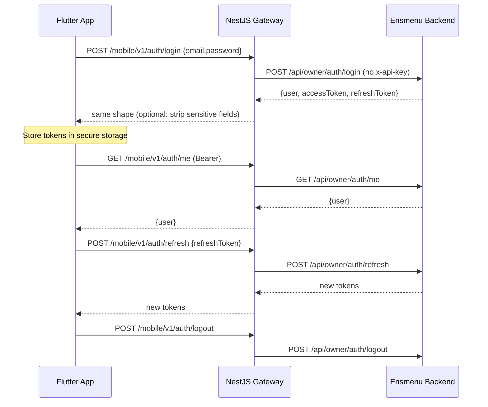
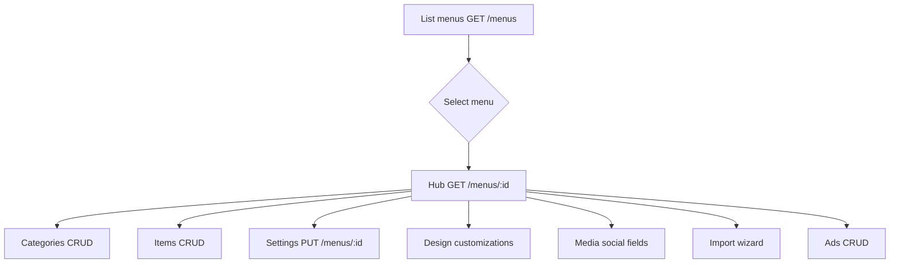
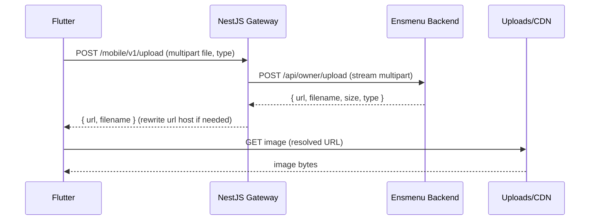
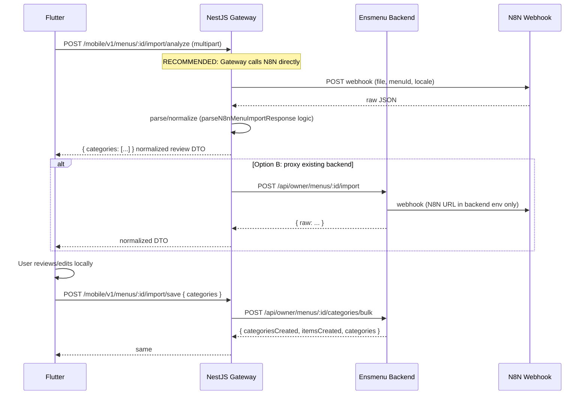
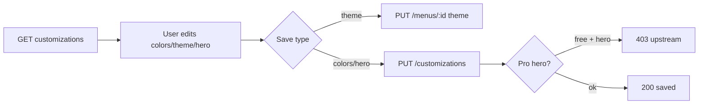
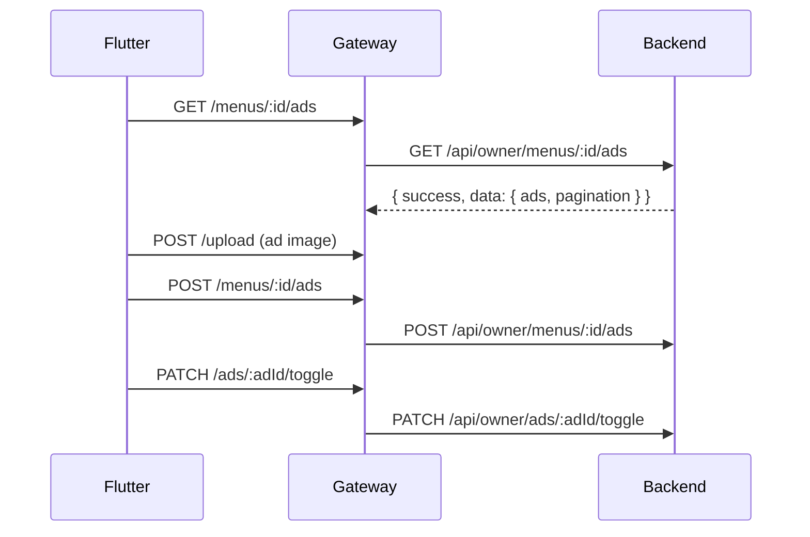
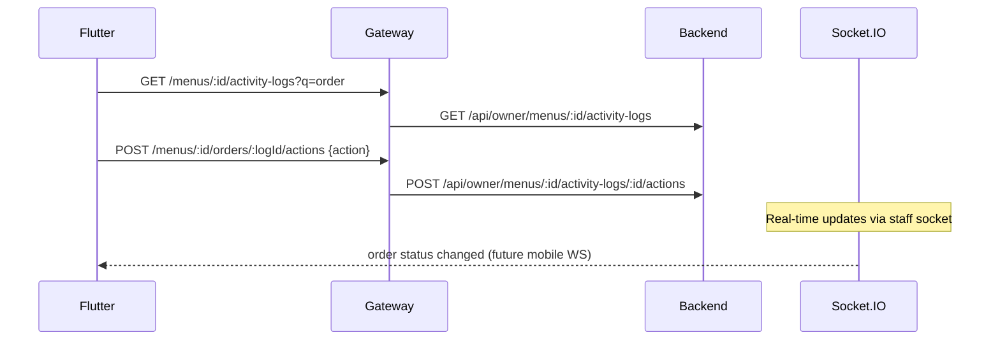
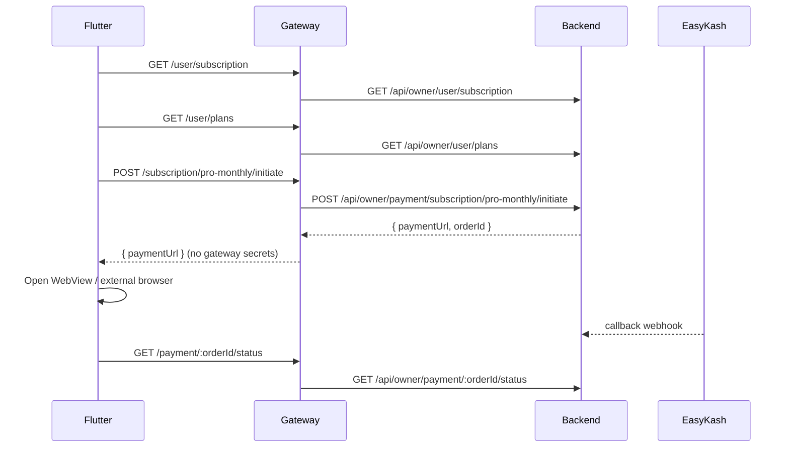
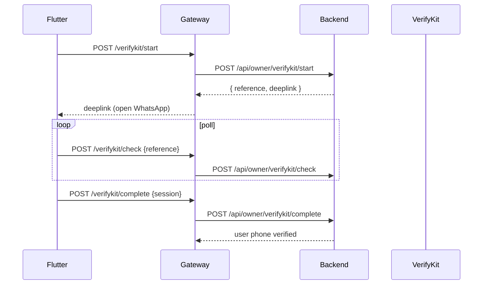

# Mobile Owner App — API Flow Map

**Purpose:** End-to-end flows for NestJS Mobile Gateway design.  
**Architecture:** Flutter → NestJS (`/mobile/v1/*`) → Ensmenu Backend (`/api/owner/*` or legacy `/api/*` with server-side credentials)

---

## 1. Global conventions

### 1.1 Headers (Flutter → NestJS)

| Header | Required | Notes |
|--------|----------|-------|
| `Authorization` | Protected routes | `Bearer <accessToken>` |
| `Accept-Language` | Optional | `ar` or `en` — forward to backend |
| `Content-Type` | JSON / multipart | As appropriate |
| `X-API-KEY` | **Never from Flutter** | Injected by NestJS only if calling legacy web routes |
| `X-Request-Id` | Optional | Gateway-generated for tracing |

### 1.2 Headers (NestJS → Backend)

| Route family | Upstream base | X-API-KEY |
|--------------|---------------|-----------|
| Owner mobile API | `{ENS_BACKEND_URL}/api/owner/*` | **No** |
| Legacy web API (avoid) | `{ENS_BACKEND_URL}/api/*` | **Yes** (server env `ENS_WEB_API_KEY`) |
| Static uploads | `{ENS_BACKEND_URL}/uploads/*` or CDN | No |

### 1.3 Error normalization (gateway responsibility)

Map upstream to mobile-friendly envelope:

```json
{
  "statusCode": 403,
  "error": "Menu not found or access denied",
  "errorAr": "المنيو غير موجود أو تم رفض الوصول",
  "code": "MENU_ACCESS_DENIED",
  "requestId": "..."
}
```

Preserve upstream status codes: 401, 403, 404, 422, 503, 504.

---

## 2. Authentication flow



### 2.1 Session restore (app launch)

1. Read `accessToken` + `refreshToken` from secure storage.
2. `GET /mobile/v1/auth/me` — if **401/405**, try refresh.
3. Refresh: `POST /mobile/v1/auth/refresh` — on failure, clear storage → login.
4. Reject tokens where `user.role !== "user"`.

### 2.2 Auth errors

| Upstream | Mobile handling |
|----------|-----------------|
| 401 no/invalid token | Clear session → login |
| 405 expired access | Refresh once, retry |
| 403 ownerRequired | Wrong role token → logout |
| 403 account locked | Show locked UI |

---

## 3. Menu lifecycle flow



### 3.1 Create menu

1. `GET /mobile/v1/menus/check-slug?slug=`
2. `POST /mobile/v1/upload` (multipart, `type=logos`)
3. `POST /mobile/v1/menus` with logo URL from upload response
4. Navigate to `/menus/:newId`

**Plan limit:** upstream 403 if `checkMenuLimit` fails.

### 3.2 Ownership enforcement

Every `/:menuId/*` route:

1. Gateway validates JWT.
2. Upstream `requireMenuOwner` returns **403** if wrong owner.
3. Gateway must **not** leak whether menu exists vs forbidden (upstream already unified).

---

## 4. Upload & image serving flow



### 4.1 Image URL rewriting

**Problem:** Backend returns URLs using `API_URL` env; mobile may need CDN/gateway host.

**Gateway options:**

| Strategy | Pros | Cons |
|----------|------|------|
| **A. Rewrite on upload response** | Simple | Must rewrite on every list payload too |
| **B. Dedicated `/mobile/v1/assets?path=`** | Single host for app | Extra hop |
| **C. CDN in front of `/uploads`** | Best performance | Infra setup |

**Flutter today:** `resolve_asset_url.dart` rewrites localhost → production. NestJS should return **final public URLs** so Flutter drops client rewriting.

### 4.2 Upload types

| `type` | Used for |
|--------|----------|
| `logos` | Menu logo, QR center logo (Pro) |
| `menu-items` | Category/item images |
| `ads` | Advertisement banners |
| `profile-images` | User avatar (future) |

### 4.3 Upload errors

| Code | Cause |
|------|-------|
| 400 | Invalid type, bad file |
| 413 | Gateway/body size limit |
| 500 | Sharp processing failure |

---

## 5. AI menu import flow



### 5.1 Why gateway should own N8N (recommended)

| Secret | Must not be in Flutter |
|--------|------------------------|
| `N8N_MENU_IMPORT_WEBHOOK` | Yes — keep in NestJS env only |
| Backend can keep route for web parity | Gateway normalizes both paths |

### 5.2 Import step states (Flutter)

| Step | UI | API |
|------|-----|-----|
| upload | pick image | — |
| processing | spinner | analyze endpoint |
| review | edit list | — |
| done | success summary | bulk save response |

### 5.3 Import errors

| HTTP | Flutter message |
|------|-----------------|
| 503 | AI service not configured |
| 422 | Could not parse menu from image |
| 504 | Analysis timed out |
| 400 | Invalid image type |
| 403 | Bulk import limit (if enabled) |

---

## 6. Design / customization flow



**Web parity:** `PATCH /menus/:id` on web vs `PUT` on owner API — gateway accepts PATCH from mobile and maps to PUT upstream if needed.

**Templates:** Flutter uses hardcoded template list (`menu_templates.dart`); web uses design page routes. Gateway does not need template registry unless centralizing.

---

## 7. Media / social flow

1. `GET /mobile/v1/menus/:id` — read social fields from menu object.
2. `PUT /mobile/v1/menus/:id` — partial update social/contact.
3. **Future:** `workingHours` JSON — web supports; Flutter not yet.

**No separate `/media` upstream route** — fields live on `Menus` table.

---

## 8. Advertisements flow



**Pro gating:** Flutter UI only today; consider gateway middleware `RequireProPlan` for parity with staff/tables routes.

---

## 9. Orders / table-call flow (planned)

**Web:** `/dashboard/:menu/orders` → `TableOrdersView`  
**Staff app:** `orders_tab_screen.dart`, `menu_activity_service.dart`  
**Flutter owner app:** Pro dialog only — **not implemented**



**Actions:** `TABLE_CALL_CONFIRMED`, `TABLE_CALL_CANCELLED`, `TABLE_CALL_PREPARED`, `TABLE_CALL_DELIVERED`

**Pro:** backend `performOwnerOrderAction` may return `PRO_REQUIRED`.

---

## 10. Subscription / payment flow (planned)

**Web routes:** subscription page, EasyKash payment  
**Flutter:** upgrade dialogs only; `GET /owner/user/subscription` used indirectly



**Gateway rules:**

- Never expose `EASYKASH_*` keys to Flutter.
- Payment redirect URL opened in in-app browser; deep link return handled by gateway or app links.
- Voucher validate/redeem: `POST /mobile/v1/vouchers/validate`, `/redeem-duration`.

---

## 11. VerifyKit flow (planned)

**Web:** modal in `RequirePhone`, subscription checkout  
**Flutter:** not wired



---

## 12. WebSocket / real-time flow (future)

**Backend:** `staffNotifications.socket.ts` — Socket.IO on same HTTP server.

| Event | Use |
|-------|-----|
| Table call / order updates | Owner orders screen |
| Menu activity | Live hub refresh |

**NestJS options:**

1. **Proxy Socket.IO** to backend (complex).
2. **Gateway WS hub** subscribing to backend Redis/pubsub (if added).
3. **Phase 1:** polling activity-logs only (current Flutter hub).

---

## 13. Staff app comparison (legacy reference)

`ensmenu_staff_app` calls **legacy web paths** with X-API-KEY (via encrypted header in web; staff app uses Bearer only on `/auth/*`):

| Feature | Staff app path | Owner app path (today) |
|---------|----------------|------------------------|
| Auth | `/auth/login` | `/owner/auth/login` |
| Menus | `/menus/*` | `/owner/menus/*` |
| Upload | `/upload` | `/owner/upload` |
| Import analyze | `FRONTEND_BASE_URL/api/menu-import` (Next.js) | `/owner/menus/:id/import` (backend) |
| Import save | `/menus/:id/categories/bulk` | same via owner prefix |

**NestJS should standardize on owner upstream paths** + server-side API key only when legacy unavoidable.

---

## 14. Caching opportunities (NestJS)

| Resource | Cache | TTL | Invalidate |
|----------|-------|-----|------------|
| `GET /user/plans` | Redis | 1h | plan admin change |
| `GET /menus/:id/customizations` | per-menu | 5m | on PUT customizations |
| Menu list `GET /menus` | per-user | 30s | on menu CRUD |
| Upload URLs | CDN | long | immutable filenames |
| Subscription status | per-user | 1m | on payment webhook |

**Do not cache:** auth tokens, import analyze, payment initiate, mutating POST/PUT/DELETE.

---

## 15. Rate limiting ideas (NestJS)

| Endpoint group | Limit |
|----------------|-------|
| `POST /auth/login` | 10/min/IP + 5/min/email |
| `POST /auth/signup` | 3/hour/IP |
| `POST */import/analyze` | 5/hour/user (expensive AI) |
| `POST /upload` | 30/hour/user |
| General API | 300/min/user |

Align with backend `apiLimiter` / `authLimiter` — gateway is first line of defense.

---

## 16. Security considerations

| Rule | Implementation |
|------|----------------|
| No secrets in Flutter | All keys in NestJS env |
| JWT validation | Gateway can validate signature with shared `JWT_ACCESS_SECRET` OR introspect via `/auth/me` |
| Menu ID tampering | Always forward to upstream ownership checks |
| SSRF on import | Gateway validates N8N URL is allowlisted |
| File upload | MIME sniff, max 10MB, virus scan optional |
| Payment URLs | Allowlist redirect domains |
| Log redaction | Never log passwords, tokens, webhook payloads |

---

## 17. Mobile-specific optimizations

| Optimization | Detail |
|--------------|--------|
| Pagination defaults | categories/items `limit=12` — gateway can cap max 50 |
| Compressed upload | Gateway optional image resize before forward (mirror backend sharp) |
| Delta responses | Future: `ETag` on menu detail |
| Batch hub load | Single `GET /menus/:id/overview` aggregator endpoint (NestJS composite) |
| Normalized DTOs | Strip unused DB fields from mobile responses |
| Push notifications | FCM token register via `POST /user/fcm-token` (future) |

---

## 18. Error handling matrix by flow

| Flow | Common errors | Gateway action |
|------|---------------|----------------|
| Login | 401, 403 lock | Pass through + `code` |
| Menu CRUD | 403 ownership, 403 plan limit | Pass through |
| Upload | 400 type, 413 size | Pass through |
| Import analyze | 503, 504, 422 | Map to stable `IMPORT_*` codes |
| Import save | 400 validation | Pass validation message |
| Design hero | 403 Pro | `PRO_REQUIRED` code |
| Ads | 404 ad not owned | Pass through |
| Orders (future) | 400 invalid transition | Pass through |
| Payment (future) | 402/409 | Pass through |

---

## 19. Related documents

- Screen-level actions: `mobile-app-screen-map.md`
- Full endpoint matrix & NestJS modules: `nestjs-mobile-gateway-map.md`
- Backend owner routes: `../ens-new-menu-back-main/docs/mobile-owner-api-live-deployment-report.md`
