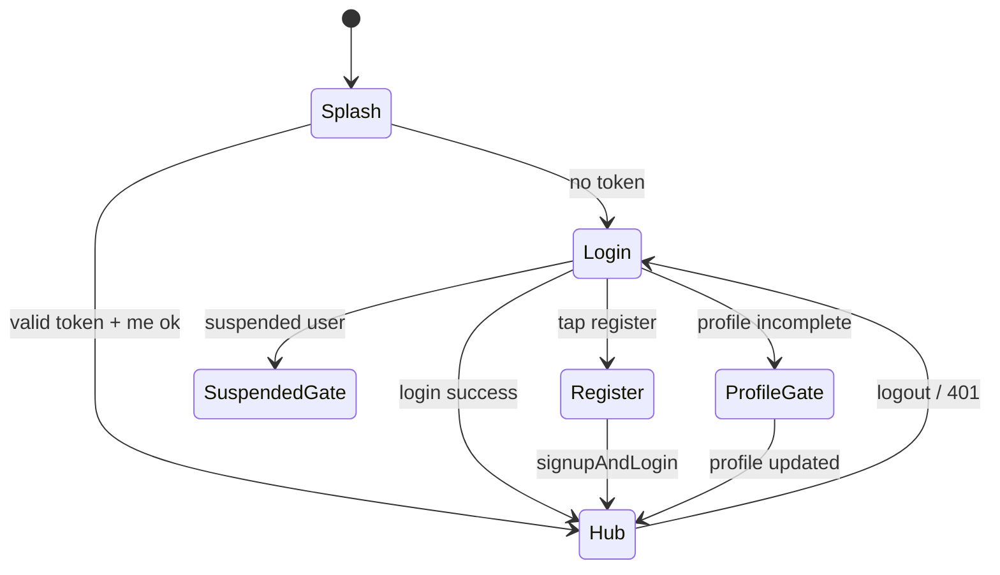

# NestJS Mobile Gateway — Complete API Map

**Version:** 1.0  
**Status:** Documentation only — **no NestJS code yet**  
**Target architecture:**

```
Flutter Owner App  →  NestJS Mobile Gateway  →  Ensmenu Backend (Express)
     (no secrets)         (/mobile/v1/*)            (/api/owner/* primary)
```

**Sources inspected:**

| Source | Path | Role |
|--------|------|------|
| Flutter owner app | `Mobile-app/lib/` | Current screens + `/owner/*` calls |
| Web dashboard | `ens-menu-main/src/` | Parity reference + legacy `/api/*` |
| Backend | `ens-new-menu-back-main/src/` | Owner routes + shared controllers |
| Legacy staff app | `ensmenu_staff_app/lib/` | `/auth/*`, `/menus/*` patterns (avoid for new gateway) |

---

## 1. Design principles

1. **Flutter calls NestJS only** — base URL e.g. `https://mobile-api.ensmenu.com`
2. **NestJS holds all secrets** — `X-API-KEY`, N8N webhook, EasyKash keys, JWT secrets for optional local validation
3. **Prefer upstream `/api/owner/*`** — no X-API-KEY required on backend
4. **Normalize responses** — stable mobile DTOs, rewritten asset URLs, bilingual errors
5. **Terminate sensitive flows at gateway when better** — AI import (N8N), payment redirect validation

### 1.1 What Flutter must NOT contain

| Forbidden in Flutter | Held in NestJS env |
|---------------------|-------------------|
| `X-API-KEY` / encrypted API key | `ENS_WEB_API_KEY` (legacy fallback only) |
| `SECRET_KEY` / `ENCRYPTION_KEY` | same |
| `N8N_MENU_IMPORT_WEBHOOK` | `N8N_WEBHOOK_URL` |
| EasyKash API/HMAC keys | `EASYKASH_*` |
| Backend admin credentials | — |
| VerifyKit secrets (if any server-side) | `VERIFYKIT_*` |

---

## 2. Recommended NestJS module structure

```
src/
├── main.ts
├── app.module.ts
├── config/
│   ├── config.module.ts
│   └── env.validation.ts          # class-validator env schema
├── common/
│   ├── guards/
│   │   ├── jwt-auth.guard.ts
│   │   └── owner-role.guard.ts
│   ├── interceptors/
│   │   ├── logging.interceptor.ts
│   │   └── transform-url.interceptor.ts
│   ├── filters/
│   │   └── upstream-exception.filter.ts
│   └── dto/
│       └── pagination.dto.ts
├── infrastructure/
│   ├── ens-backend/
│   │   ├── ens-backend.module.ts
│   │   ├── ens-http.service.ts    # axios/fetch to Express backend
│   │   └── ens-owner.client.ts    # typed owner route client
│   ├── redis/
│   │   └── cache.module.ts        # optional phase 2
│   └── storage/
│       └── asset-url.service.ts
├── modules/
│   ├── auth/
│   │   ├── auth.module.ts
│   │   ├── auth.controller.ts     # /mobile/v1/auth/*
│   │   └── auth.service.ts
│   ├── menus/
│   │   ├── menus.module.ts
│   │   ├── menus.controller.ts
│   │   └── menus.service.ts
│   ├── catalog/
│   │   ├── categories.controller.ts
│   │   └── items.controller.ts
│   ├── upload/
│   │   ├── upload.module.ts
│   │   └── upload.controller.ts   # multipart pass-through
│   ├── design/
│   │   └── customizations.controller.ts
│   ├── media/
│   │   └── media.controller.ts    # thin wrapper over menu PATCH
│   ├── ads/
│   │   └── ads.controller.ts
│   ├── import/
│   │   ├── import.module.ts
│   │   ├── import.controller.ts
│   │   ├── n8n.client.ts          # N8N webhook (secret here)
│   │   └── import-normalizer.service.ts
│   ├── subscription/
│   │   ├── subscription.controller.ts
│   │   └── payment.controller.ts
│   ├── verifykit/
│   │   └── verifykit.controller.ts
│   ├── orders/                    # phase 2
│   │   └── orders.controller.ts
│   ├── staff/                     # phase 2
│   ├── tables/                    # phase 2
│   ├── analytics/                 # phase 2
│   └── health/
│       └── health.controller.ts
└── websocket/                     # phase 3
    └── orders.gateway.ts
```

---

## 3. Gateway URL convention

| Layer | Prefix | Example |
|-------|--------|---------|
| Flutter → NestJS | `/mobile/v1` | `POST /mobile/v1/auth/login` |
| NestJS → Backend (owner) | `/api/owner` | `POST /api/owner/auth/login` |
| NestJS → Backend (legacy) | `/api` + x-api-key | avoid |

---

## 4. Master API map — implemented in Flutter today

Columns:

- **NestJS route** — what Flutter will call
- **Upstream (owner)** — Express backend today
- **Web legacy** — what dashboard uses (requires X-API-KEY)
- **X-API-KEY on upstream** — No for `/api/owner/*`
- **Proxy?** — Yes = forward; Terminate = gateway handles
- **Auth** — Public / Bearer owner JWT
- **Ownership** — Backend `requireMenuOwner`
- **Pro** — Backend or UI gate

### 4.1 Authentication

| NestJS route | Method | Upstream owner | Web legacy | X-API-KEY | Proxy | Auth | Body | Response |
|--------------|--------|----------------|------------|-----------|-------|------|------|----------|
| `/mobile/v1/auth/check-availability` | GET | `/api/owner/auth/check-availability` | `/api/auth/check-availability` | legacy: Yes | Yes | Public | query: `email?`, `phoneNumber?` | `{ isAvailable, ... }` |
| `/mobile/v1/auth/signup` | POST | `/api/owner/auth/signup` | `/api/auth/signup` | legacy: Yes | Yes | Public | `{ name, email, password, phoneNumber, restaurantName?, locale }` | user + tokens or message |
| `/mobile/v1/auth/login` | POST | `/api/owner/auth/login` | `/api/auth/login` | legacy: Yes | Yes | Public | `{ email, password }` | `{ message, user, accessToken, refreshToken }` |
| `/mobile/v1/auth/refresh` | POST | `/api/owner/auth/refresh` | `/api/auth/refresh` | legacy: Yes | Yes | Public | `{ refreshToken }` | new tokens |
| `/mobile/v1/auth/forgot-password` | POST | `/api/owner/auth/forgot-password` | `/api/auth/forgot-password` | legacy: Yes | Yes | Public | `{ email, locale? }` | success message |
| `/mobile/v1/auth/reset-password` | POST | `/api/owner/auth/reset-password` | `/api/auth/reset-password` | legacy: Yes | Yes | Public | `{ token, newPassword, locale? }` | success |
| `/mobile/v1/auth/me` | GET | `/api/owner/auth/me` | `/api/auth/me` | legacy: Yes | Yes | Bearer | — | `{ user }` |
| `/mobile/v1/auth/logout` | POST | `/api/owner/auth/logout` | `/api/auth/logout` | legacy: Yes | Yes | Bearer | `{ refreshToken }` | success |
| `/mobile/v1/auth/google` | POST | `/api/owner/auth/google` | `/api/auth/google` | legacy: Yes | Yes | Public | google token/code | user + tokens |

**Errors:** 401 invalid creds; 403 locked; 403 wrong role on protected routes.

---

### 4.2 User profile & subscription

| NestJS route | Method | Upstream owner | Web legacy | Proxy | Auth | Notes |
|--------------|--------|----------------|------------|-------|------|-------|
| `/mobile/v1/user/profile` | GET | `/api/owner/user/profile` | `/api/user/profile` | Yes | Bearer | |
| `/mobile/v1/user/profile` | PUT | `/api/owner/user/profile` | `PATCH /api/user/profile` | Yes | Bearer | multipart optional |
| `/mobile/v1/user/subscription` | GET | `/api/owner/user/subscription` | `/api/user/subscription` | Yes | Bearer | plan limits |
| `/mobile/v1/user/plans` | GET | `/api/owner/user/plans` | `/api/user/plans` | Yes | Bearer | |
| `/mobile/v1/user/change-password` | POST | `/api/owner/user/change-password` | `/api/user/change-password` | Yes | Bearer | Phase 2 screen |
| `/mobile/v1/user/account` | DELETE | `/api/owner/user/account` | `/api/user/account` | Yes | Bearer | Phase 2 |

---

### 4.3 Menus

| NestJS route | Method | Upstream owner | Web legacy | Proxy | Auth | Ownership | Body / query |
|--------------|--------|----------------|------------|-------|------|-----------|--------------|
| `/mobile/v1/menus` | GET | `/api/owner/menus` | `GET /api/menus` | Yes | Bearer | user menus only | `locale?` |
| `/mobile/v1/menus` | POST | `/api/owner/menus` | `POST /api/menus` | Yes | Bearer | — | `{ nameAr, nameEn, logo, theme?, slug?, ... }` |
| `/mobile/v1/menus/check-slug` | GET | `/api/owner/menus/check-slug` | same | Yes | Bearer | — | `slug` |
| `/mobile/v1/menus/:menuId` | GET | `/api/owner/menus/:id` | `GET /api/menus/:id` | Yes | Bearer | **403** wrong owner | — |
| `/mobile/v1/menus/:menuId` | PUT | `/api/owner/menus/:id` | `PATCH /api/menus/:id` | Yes | Bearer | **403** | partial menu + social fields |
| `/mobile/v1/menus/:menuId/status` | PUT | `/api/owner/menus/:id/status` | toggle route | Yes | Bearer | **403** | `{ isActive }` |
| `/mobile/v1/menus/:menuId` | DELETE | `/api/owner/menus/:id` | `DELETE /api/menus/:id` | Yes | Bearer | **403** | — |

**GET menu response includes:** `socialFacebook`, `socialInstagram`, `socialTwitter`, `socialWhatsapp`, `addressAr`, `addressEn`, `phone`, `workingHours`, `logo`, `theme`, translations.

**Plan check:** POST menu → backend `checkMenuLimit` → 403 if exceeded.

---

### 4.4 Categories

| NestJS route | Method | Upstream owner | Web legacy | Proxy | Auth | Ownership |
|--------------|--------|----------------|------------|-------|------|-----------|
| `/mobile/v1/menus/:menuId/categories` | GET | `/api/owner/menus/:menuId/categories` | same prefix | Yes | Bearer | **403** |
| `/mobile/v1/menus/:menuId/categories` | POST | same | same | Yes | Bearer | **403** |
| `/mobile/v1/menus/:menuId/categories/:categoryId` | GET | same | same | Yes | Bearer | **403** |
| `/mobile/v1/menus/:menuId/categories/:categoryId` | PUT | same | `PATCH` on web | Yes | Bearer | **403** |
| `/mobile/v1/menus/:menuId/categories/:categoryId` | DELETE | same | same | Yes | Bearer | **403** |

**List response:** `{ categories: [], pagination: { total, page, limit, totalPages } }`

---

### 4.5 Items

| NestJS route | Method | Upstream owner | Proxy | Auth | Ownership |
|--------------|--------|----------------|-------|------|-----------|
| `/mobile/v1/menus/:menuId/items` | GET | `/api/owner/menus/:menuId/items` | Yes | Bearer | **403** |
| `/mobile/v1/menus/:menuId/items` | POST | same | Yes | Bearer | **403** |
| `/mobile/v1/menus/:menuId/items/:itemId` | GET | same | Yes | Bearer | **403** |
| `/mobile/v1/menus/:menuId/items/:itemId` | PUT | same | Yes | Bearer | **403** |
| `/mobile/v1/menus/:menuId/items/:itemId` | DELETE | same | Yes | Bearer | **403** |
| `/mobile/v1/menus/:menuId/items/reorder` | POST | same | Yes | Bearer | **403** |

**Query:** `page`, `limit`, `search`, `categoryId`, `available`, `locale`

---

### 4.6 Upload

| NestJS route | Method | Upstream owner | Web legacy | Proxy | Auth |
|--------------|--------|----------------|------------|-------|------|
| `/mobile/v1/upload` | POST | `/api/owner/upload` | `POST /api/upload` | Yes (stream multipart) | Bearer |
| `/mobile/v1/upload/:filename` | DELETE | `/api/owner/upload/:filename` | same | Yes | Bearer |
| `/mobile/v1/upload/:filename/info` | GET | `/api/owner/upload/:filename/info` | same | Yes | Bearer |

**Request:** multipart field `file`; optional `type`: `logos` | `menu-items` | `ads` | `profile-images`

**Response:**

```json
{
  "message": "File uploaded successfully",
  "url": "https://cdn.ensmenu.com/uploads/menu-items/uuid.webp",
  "filename": "uuid.webp",
  "size": 12345,
  "type": "image/webp"
}
```

**Gateway:** rewrite `url` host to public CDN (`ASSET_PUBLIC_BASE_URL`).

---

### 4.7 Design / customizations

| NestJS route | Method | Upstream owner | Web legacy | Proxy | Auth | Pro |
|--------------|--------|----------------|------------|-------|------|-----|
| `/mobile/v1/menus/:menuId/customizations` | GET | `/api/owner/menus/:menuId/customizations` | same | Yes | Bearer | — |
| `/mobile/v1/menus/:menuId/customizations` | PUT | same | `PATCH` web | Yes | Bearer | hero: **Pro** |
| `/mobile/v1/menus/:menuId/customizations` | DELETE | same | same | Yes | Bearer | — |

**PUT body:**

```json
{
  "primaryColor": "#7C3AED",
  "secondaryColor": "#6366F1",
  "backgroundColor": "#ffffff",
  "textColor": "#0f172a",
  "heroTitleAr": "",
  "heroTitleEn": "",
  "heroSubtitleAr": "",
  "heroSubtitleEn": ""
}
```

**Theme change:** `PUT /mobile/v1/menus/:menuId` with `{ "theme": "default|neon|coffee|sky|..." }`

---

### 4.8 Media (social / contact)

No separate backend resource — uses menu PUT.

| NestJS route | Method | Upstream | Proxy | Body fields |
|--------------|--------|----------|-------|-------------|
| `/mobile/v1/menus/:menuId/media` | GET | `GET /api/owner/menus/:id` | Yes | returns social subset DTO |
| `/mobile/v1/menus/:menuId/media` | PUT | `PUT /api/owner/menus/:id` | Yes | `socialFacebook`, `socialInstagram`, `socialTwitter`, `socialWhatsapp`, `addressAr`, `addressEn`, `phone` |

**Missing in Flutter:** `workingHours` — include in gateway DTO for future.

---

### 4.9 Advertisements

| NestJS route | Method | Upstream owner | Proxy | Auth | Ownership | Pro |
|--------------|--------|----------------|-------|------|-----------|-----|
| `/mobile/v1/menus/:menuId/ads` | GET | `/api/owner/menus/:menuId/ads` | Yes | Bearer | **403** | UI: Pro |
| `/mobile/v1/menus/:menuId/ads` | POST | same | Yes | Bearer | **403** | UI: Pro |
| `/mobile/v1/ads/:adId` | PUT | `/api/owner/ads/:adId` | Yes | Bearer | controller check | |
| `/mobile/v1/ads/:adId` | DELETE | same | Yes | Bearer | controller check | |
| `/mobile/v1/ads/:adId/toggle` | PATCH | `/api/owner/ads/:adId/toggle` | Yes | Bearer | controller check | |

**List response:** `{ success: true, data: { ads: [], pagination: {} } }`

**Create response:** `{ success: true, data: { adId: number } }`

---

### 4.10 AI menu import

| NestJS route | Method | Upstream owner | Web path | Proxy | Auth | Notes |
|--------------|--------|----------------|----------|-------|------|-------|
| `/mobile/v1/menus/:menuId/import/analyze` | POST | `/api/owner/menus/:menuId/import` | `POST /api/menu-import` (Next.js) | **Terminate recommended** | Bearer | N8N secret in gateway |
| `/mobile/v1/menus/:menuId/import/can-use` | GET | `/api/owner/menus/:menuId/categories/bulk/canuse` | same | Yes | Bearer | |
| `/mobile/v1/menus/:menuId/import/save` | POST | `/api/owner/menus/:menuId/categories/bulk` | direct bulk | Yes | Bearer | |

**Analyze upstream response (backend):** `{ raw: <parsed JSON> }`  
**Gateway normalized response (recommended):**

```json
{
  "categories": [
    {
      "id": "cat-0",
      "nameAr": "...",
      "nameEn": "...",
      "items": [{ "nameAr", "nameEn", "price", "descriptionAr?", "imageUrl?" }]
    }
  ]
}
```

**Bulk save body:** `{ "categories": [ { "nameAr", "nameEn", "items": [...] } ] }`

**Bulk save response (201):**

```json
{
  "message": "Bulk import completed successfully",
  "categoriesCreated": 3,
  "itemsCreated": 24,
  "categories": [...]
}
```

**Errors:** 503 N8N not configured; 504 timeout; 422 parse failure.

---

### 4.11 Activity logs (hub + future)

| NestJS route | Method | Upstream owner | Proxy | Auth | Used by |
|--------------|--------|----------------|-------|------|---------|
| `/mobile/v1/menus/:menuId/activity-logs` | GET | `/api/owner/menus/:menuId/activity-logs` | Yes | Bearer | Hub (limit 5) |
| `/mobile/v1/menus/:menuId/activity-logs/:id` | GET | same | Yes | Bearer | Future history |
| `/mobile/v1/menus/:menuId/orders/:logId/actions` | POST | `/api/owner/menus/:menuId/activity-logs/:id/actions` | Yes | Bearer | Future orders |

**Order action body:** `{ "action": "TABLE_CALL_CONFIRMED" | ... }`

---

## 5. API map — Phase 2 (web parity, not in Flutter yet)

| NestJS route | Upstream owner | Web legacy | Pro backend | Notes |
|--------------|----------------|------------|-------------|-------|
| `GET /mobile/v1/menus/:id/analytics` | `/api/owner/menus/:id/analytics` | same | **requireProPlan** | period=7d\|30d\|90d |
| `GET/POST/PUT/DELETE .../staff/*` | `/api/owner/menus/:id/staff/*` | same | **requireProPlan** | staff app has services |
| `GET/POST/PUT/DELETE .../tables/*` | `/api/owner/menus/:id/tables/*` | same | **requireProPlan** | |
| `POST /mobile/v1/vouchers/validate` | `/api/owner/vouchers/validate` | same | — | subscription |
| `POST /mobile/v1/vouchers/redeem-duration` | `/api/owner/vouchers/redeem-duration` | same | — | |
| `POST /mobile/v1/subscription/pro-monthly/initiate` | `/api/owner/payment/subscription/pro-monthly/initiate` | `/api/payment/...` | phone verified? | returns payment URL |
| `POST /mobile/v1/subscription/pro-yearly/initiate` | `/api/owner/payment/.../pro-yearly/initiate` | same | | |
| `GET /mobile/v1/payment/:orderId/status` | `/api/owner/payment/:orderId/status` | same | | poll after checkout |
| `POST /mobile/v1/subscription/downgrade-to-free` | `/api/owner/user/subscription/downgrade-to-free` | same | | |
| `POST /mobile/v1/subscription/recover-payment` | `/api/owner/user/subscription/recover-payment` | same | | |
| `POST /mobile/v1/verifykit/start` | `/api/owner/verifykit/start` | `/api/verifykit/start` | | WhatsApp deeplink |
| `POST /mobile/v1/verifykit/check` | `/api/owner/verifykit/check` | same | | |
| `POST /mobile/v1/verifykit/complete` | `/api/owner/verifykit/complete` | same | | |
| `POST /mobile/v1/user/fcm-token` | `/api/owner/user/fcm-token` | push register | | push notifications |

---

## 6. X-API-KEY matrix

| Upstream path prefix | X-API-KEY required? | Mobile gateway action |
|---------------------|---------------------|------------------------|
| `/api/owner/*` | **No** | Forward Bearer only |
| `/api/owner/auth/*` | **No** | Forward |
| `/api/auth/*` | **Yes** | Do not use — use owner auth |
| `/api/menus/*` | **Yes** | Do not use — use owner menus |
| `/api/upload` | **Yes** | Do not use — use owner upload |
| `/api/public/*` | No | Public config only if needed |
| `/uploads/*` | No | CDN/static |

---

## 7. Auth flow diagram



**JWT payload (from backend):** `{ userId, email, role: "user" }`  
**Gateway guards:** `JwtAuthGuard` + `OwnerRoleGuard` on all non-public `/mobile/v1/*` routes.

---

## 8. Upload / import architecture diagram

```mermaid
flowchart TB
  subgraph flutter [Flutter]
    F1[Photo picker]
    F2[Multipart upload]
    F3[Import wizard]
  end

  subgraph gateway [NestJS Gateway]
    G1[UploadController]
    G2[ImportController]
    G3[N8nClient]
    G4[ImportNormalizer]
    G5[AssetUrlService]
  end

  subgraph backend [Ensmenu Backend]
    B1[/api/owner/upload]
    B2[/api/owner/menus/:id/categories/bulk]
  end

  subgraph external [External]
    N8N[N8N Webhook]
    CDN[/uploads CDN]
  end

  F2 --> G1 --> B1 --> G5 --> F2
  F3 --> G2 --> G3 --> N8N
  G3 --> G4 --> F3
  F3 --> G2 --> B2
  F2 --> CDN
```

---

## 9. Image serving flow

1. Backend stores file at `/uploads/{type}/{uuid}.webp`
2. Backend returns `url` using `API_URL` env
3. **NestJS `AssetUrlService`** rewrites to `ASSET_PUBLIC_BASE_URL` (e.g. `https://ensapi.ensbot.net` or CDN)
4. Flutter displays via resolved URL — **no client-side secret rewriting needed after gateway**

Optional: gateway `GET /mobile/v1/assets/proxy?path=/uploads/...` for environments without public upload host (not recommended for production scale).

---

## 10. WebSocket / orders (Phase 3)

**Backend today:** Socket.IO in `staffNotifications.socket.ts` — staff/order events.

**Mobile gateway options:**

| Option | Description |
|--------|-------------|
| A | Flutter polls `activity-logs` (current hub) |
| B | NestJS WebSocket gateway bridges backend socket |
| C | Redis pub/sub between backend events and gateway WS |

**Recommended Phase 1:** polling only. Phase 3: Option B for order screen.

---

## 11. Payment redirect handling

1. Flutter calls `POST /mobile/v1/subscription/pro-monthly/initiate`
2. Gateway proxies to `/api/owner/payment/...` — backend returns `{ paymentUrl, orderId }`
3. Flutter opens **in-app WebView** to `paymentUrl` (EasyKash)
4. Return via deep link / `GET /mobile/v1/payment/:orderId/status` polling
5. Gateway never exposes EasyKash keys

**Backend public callback:** `/api/payment/redirect` — handled by payment provider, not Flutter.

---

## 12. What can be implemented immediately in NestJS

These have **complete upstream owner routes** and **Flutter consumers today**:

| Priority | Module | Routes | Effort |
|----------|--------|--------|--------|
| P0 | auth | login, refresh, me, logout, signup, check-availability | Low — pure proxy |
| P0 | menus | CRUD, check-slug, list | Low |
| P0 | catalog | categories + items CRUD | Low |
| P0 | upload | POST multipart pass-through + URL rewrite | Medium |
| P1 | design | customizations GET/PUT/DELETE | Low |
| P1 | media | menu GET/PUT social fields | Low |
| P1 | ads | full CRUD + toggle | Low |
| P1 | import | analyze (terminate N8N) + bulk save | Medium |
| P1 | activity | activity-logs list for hub | Low |
| P2 | subscription | plans, subscription GET | Low |
| P2 | payment | initiate + status poll | Medium |
| P2 | verifykit | start/check/complete | Medium |

**MVP gateway (2–3 weeks):** P0 + P1 rows = full parity with current Flutter app.

---

## 13. What is missing or unclear

| Item | Status | Action needed |
|------|--------|---------------|
| NestJS repo location | **Not created** | Create `ens-mobile-gateway` repo |
| Flutter base URL switch | Points to Express today | Change `API_BASE_URL` to gateway after MVP |
| `workingHours` in Flutter media | Web has JSON schedule | Product decision + UI |
| Analytics screen | Pro dialog only | Design mobile analytics DTO |
| Orders screen | Pro dialog only | Confirm WS vs polling |
| Staff / tables screens | Pro dialog only | Copy staff app flows |
| VerifyKit in Flutter | Profile gate partial | Wire WhatsApp deeplink flow |
| Google auth in Flutter | Not implemented | Gateway route exists upstream |
| FCM push registration | Not in Flutter | `POST /user/fcm-token` |
| Menu import via Next.js vs backend | Web uses `/api/menu-import` proxy | Gateway should unify on N8N |
| PATCH vs PUT on web | Web uses PATCH, owner uses PUT | Gateway normalizes method |
| QR scan count field | Verify on menu detail response | Confirm field name with backend |
| Pro enforcement on ads | UI only, not backend middleware | Product: enforce at gateway? |
| Rate limits alignment | Backend has limiters | Document gateway + backend double limits |
| JWT validation at gateway | Optional local verify vs proxy-only | Security architecture decision |
| CDN for `/uploads` | May not exist on all envs | Infra ticket |
| Bilingual error passthrough | Backend sends error/errorAr | Gateway preserve both |

---

## 14. Environment variables (NestJS only)

| Variable | Required | Purpose |
|----------|----------|---------|
| `PORT` | Yes | Gateway listen port |
| `ENS_BACKEND_URL` | Yes | e.g. `https://ensapi.ensbot.net` |
| `JWT_ACCESS_SECRET` | Optional | Local JWT validation (same as backend) |
| `ASSET_PUBLIC_BASE_URL` | Yes | Rewrite upload URLs for mobile |
| `N8N_WEBHOOK_URL` | For import | AI analyze (do not use backend route if terminating here) |
| `ENS_WEB_API_KEY` | Fallback only | Legacy routes — avoid |
| `EASYKASH_*` | Phase 2 payment | If gateway initiates payment directly (prefer proxy) |
| `REDIS_URL` | Optional | Caching |
| `CORS_ORIGINS` | Yes | Flutter app (mobile origins minimal) |
| `PUBLIC_MENU_HOST_SUFFIX` | Yes | Build public menu links for share tab |

---

## 15. Flutter migration checklist (post-gateway)

When NestJS MVP is deployed:

1. Change `kApiBaseUrl` to gateway URL (`https://mobile-api.ensmenu.com/mobile/v1` or separate host)
2. Replace `/owner/` path prefix in repositories with gateway paths (or keep gateway paths identical to `/mobile/v1/...`)
3. Remove `resolve_asset_url.dart` localhost hacks once gateway returns final URLs
4. Remove direct N8N/503 handling duplication if gateway normalizes import errors
5. Add integration tests against gateway staging

---

## 16. Related documents

| Document | Location |
|----------|----------|
| Screen & action map | `docs/mobile-app-screen-map.md` |
| Flow diagrams & errors | `docs/mobile-api-flow-map.md` |
| Backend owner deployment | `../ens-new-menu-back-main/docs/mobile-owner-api-live-deployment-report.md` |

---

**End of NestJS Mobile Gateway API map.**
